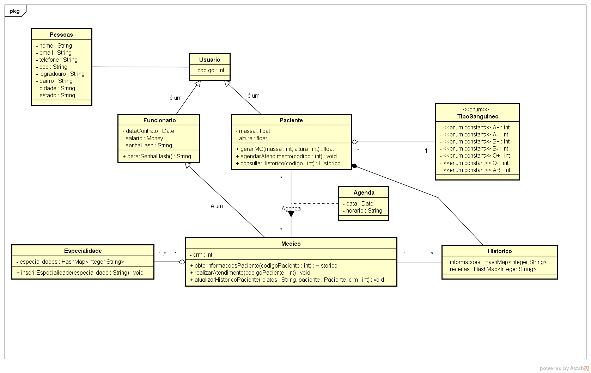
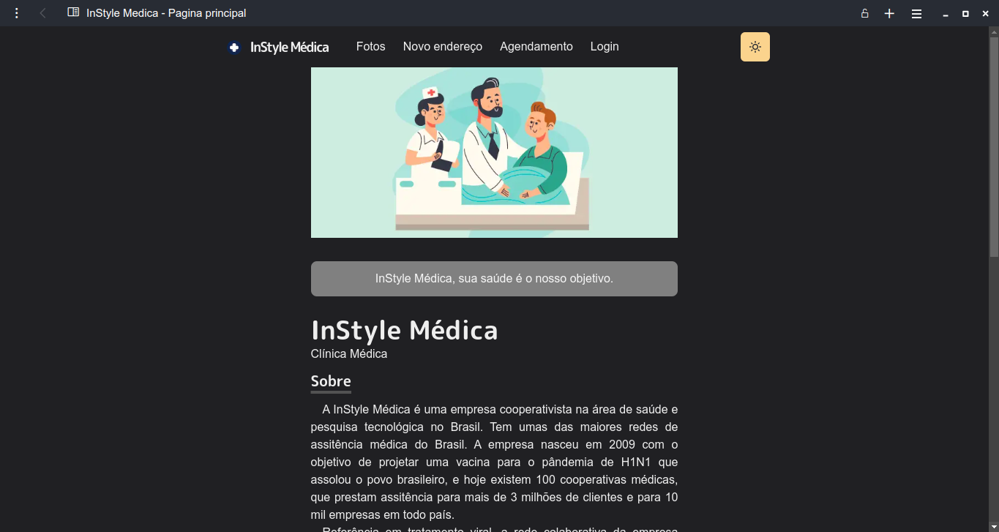
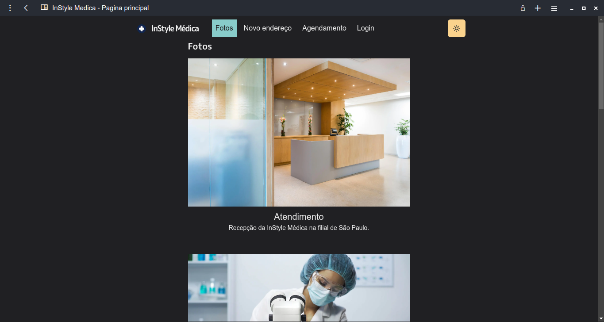
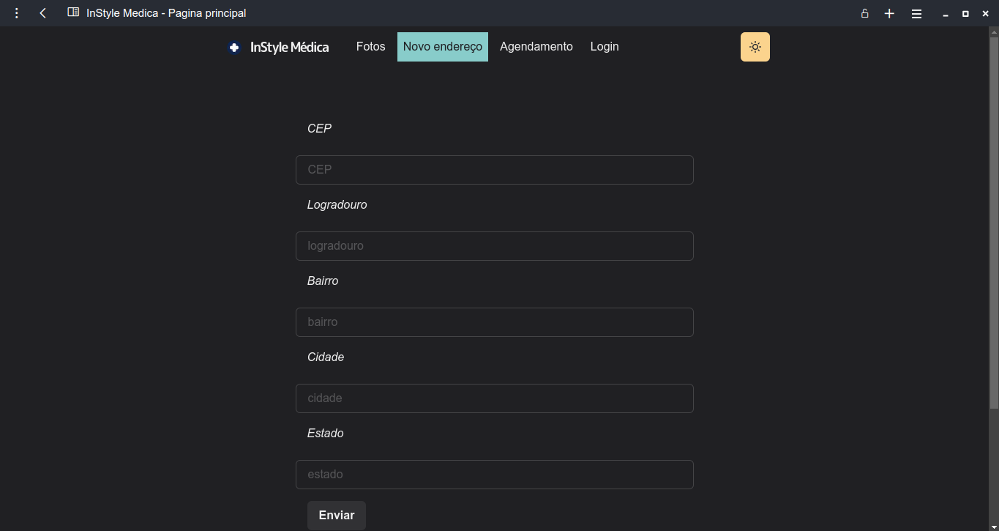

# InStyle Medica

Integrantes do grupo:

- Fernando Garamvolgyi Mafra Veizaga - 20203001902
- Gabriel Siqueira Silva - 20203008814

## Diagrama de classe

Para a implementação das tarefas de cada um dos participantes do sistema pensou-se no seguinte diagrama de classe.

	

## Página principal

A primeira página irá conectar à todas as outras e ainda contará com um pequeno enunciado sobre a empresa juntamente do seu histórico.

	

## Página de fotos

A segunda página contém algumas imagens relacionadas a empresa como equipamentos, recepção e procedimento de pesquisa.

	

## Página de endereços

Página auxiliar para a composição do banco de dados.

	

## Página de agendamento

Em construção. Página que utilizará duas manipulações de banco de dados, uma para preenchimento de agenda como a página de endereços e outra para o preenchimento dinâmico do select para obtenção dos médicos de cada especialidade. Em relação ao horário, para facilitar a marcação de exames considerou-se que horas, data, médico e paciente sejam a chave primária.
Ainda na página de agendamento, será utilizado o express.js para conexão com banco de dados para dinamização dos selects.

