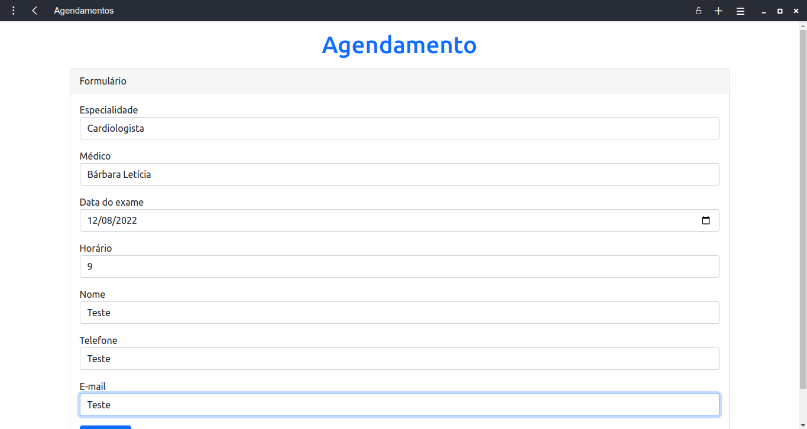
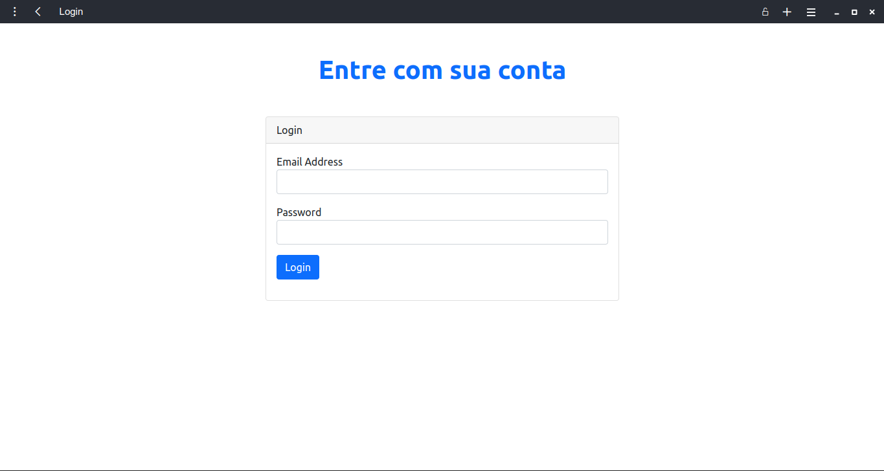

# InStyle Medica

Integrantes do grupo:

- Fernando Garamvolgyi Mafra Veizaga - 20203001902
- Gabriel Siqueira Silva - 20203008814

# Visualização do usuário

## Diagrama de classe

Para a implementação das tarefas de cada um dos participantes do sistema pensou-se no seguinte diagrama de classe.

	

## Página principal

A primeira página irá conectar à todas as outras e ainda contará com um pequeno enunciado sobre a empresa juntamente do seu histórico.

	

## Página de fotos

A segunda página contém algumas imagens relacionadas a empresa como equipamentos, recepção e procedimento de pesquisa.

	

## Página de endereços

Página auxiliar para a composição do banco de dados.

	

## Página de agendamento - Utilização do Express.js em outra porta

Página que utilizará duas manipulações de banco de dados, uma para preenchimento de agenda como a página de endereços e outra para o preenchimento dinâmico do select para obtenção dos médicos de cada especialidade. Em relação ao horário, para facilitar a marcação de exames considerou-se que horas, data, médico e paciente sejam a chave primária.

	

## Página de login - Utilização do Express.js em outra porta

Página de conexão para o CRUD (Create, Read, Update, Delete). 

	

# Visualização do administrador

## CRUD

Para esta parte do projeto, além do React e do Node.js, foram utilizadas as bibliotecas Axios, Nodemon e React-router-dom.

##Página inicial da área restrita:

